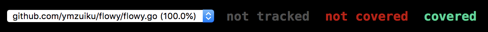

# Use ternary operator in Golang

> [查看中文文档](./README-CN.md)

Golang's design philosophy is that there is only one solution to a thing, so even ternary operations are not provided. The official idea is to use if / else instead of ternary operations.

If you're used to writing code with more general statements, you might want to write code like this:

```js
var a = 20 > 50 ? true: false;  // a = false
var b = a || 100  // b = 100
var c = b && 50  // c = 50
var fn = c > 40 && func(){ return "ok" } // fn = "ok"
```

After using hit, the above code can be written in this way:

```go
var a = If(20 > 50, true, false)  // a = false
var b = Or(a, 100)  // b = 100
var c = If(b, 50)  // c = 50
var fn = If(c > 40, func(){ return "ok" }) // fn = "ok"
```

Beatle! Abandon dogma and enjoy `hit`.


## Install

```
$ go get github.com/ymzuiku/hit
```

Only two API

```go
func If(args ...interface{}) interface{}
func Or(args ...interface{}) interface{}
```

## Examples

> When need return the param, and the param is `func` run it and use return value

Condition implicit conversion to `FALSE`

- nil
- 0
- error
- ""
- "f", "F", "false", "FALSE", "False"
- "0", "0.0", "-0"


### `If(a, b, c)` such as `a ? b : c`

if `a` == `TRUE`, return `b`, else return `c`

```go
import . "github.com/ymzuiku/hit"

func main(){
  value1 := If(20 > 5, "ok", "cancel")
	log.Println(value1) // ok

	value2 := If("test", "ok", "cancel")
	log.Println(value2) // ok

	value3 := If("", "ok", "cancel")
	log.Println(value3) // cancel

	value4 := If("false", "ok", "cancel")
	log.Println(value4) // cancel

	value5 := If(5, "ok", "cancel")
	log.Println(value5) // ok

	value6 := If(0, "ok", "cancel")
	log.Println(value6) // cancel

	value7 := If(nil, "ok", "cancel")
	log.Println(value7) // cancel

	value8 := If(errors.New("test-error"), func() { log.Println("if err != nil, this param no use" }) // value8 is error

	// If any params is tpyeof `func()`, hit run it and return <nil>
	value9 := If(20 > 5, func() { log.Println("ok") }, func() { log.Println("cancel") }) // run: log.Println("ok"), value = nil

	// If any params is tpyeof `func()interface{}`, hit can run it and use condition.
	value10 := If(func() interface{} { return true }, func()interface{} { return "ok"  }, func()interface{} { return "cancel" })
	log.Println(value9) // ok
}
```

### `If(a, b)` such as `a && b`

if `a` == `TRUE`, return `b`, else return `nil`

```go
import . "github.com/ymzuiku/hit"

func main(){
  value1 := If("test", "ok")
	log.Println(value1) // "ok"

	value2 := If(500, "ok")
	log.Println(value2) // 500

	value3 := If(func() interface{} { return false }, func() { log.Println("this func no run") })
	log.Println(value3) // func no run, and value = nil

	value4 := If(func() interface{} { return true }, func() interface{} { log.Println("func is run"); return 50 })
	log.Println(value4) // func is run, and value = 50
}
```

### `Or(a, b)` such as `a || b`

if `a` == `TRUE`, return `a`, else return `b`

```go
import . "github.com/ymzuiku/hit"

func main(){
	value1 := Or("test", "ok")
	log.Println(value1) // "test"

	value2 := Or(500, "ok")
	log.Println(value2) // "ok"

	value3 := Or(func() interface{} { return 100 }, func() { log.Println("this func no run") })
	log.Println(value3) // func no run, and value = 100

	value4 := Or(func() interface{} { return false }, func() interface{} { log.Println("func is run"); return 50 })
	log.Println(value4) // func is run, and value = 50
}
```

## Test list:



Pass test to 100% coverage, view test code: [hit_test.go](./hit_test.go)

### License

```
MIT License

Copyright (c) 2013-present, Facebook, Inc.

Permission is hereby granted, free of charge, to any person obtaining a copy
of this software and associated documentation files (the "Software"), to deal
in the Software without restriction, including without limitation the rights
to use, copy, modify, merge, publish, distribute, sublicense, and/or sell
copies of the Software, and to permit persons to whom the Software is
furnished to do so, subject to the following conditions:

The above copyright notice and this permission notice shall be included in all
copies or substantial portions of the Software.

THE SOFTWARE IS PROVIDED "AS IS", WITHOUT WARRANTY OF ANY KIND, EXPRESS OR
IMPLIED, INCLUDING BUT NOT LIMITED TO THE WARRANTIES OF MERCHANTABILITY,
FITNESS FOR A PARTICULAR PURPOSE AND NONINFRINGEMENT. IN NO EVENT SHALL THE
AUTHORS OR COPYRIGHT HOLDERS BE LIABLE FOR ANY CLAIM, DAMAGES OR OTHER
LIABILITY, WHETHER IN AN ACTION OF CONTRACT, TORT OR OTHERWISE, ARISING FROM,
OUT OF OR IN CONNECTION WITH THE SOFTWARE OR THE USE OR OTHER DEALINGS IN THE
SOFTWARE.
```
